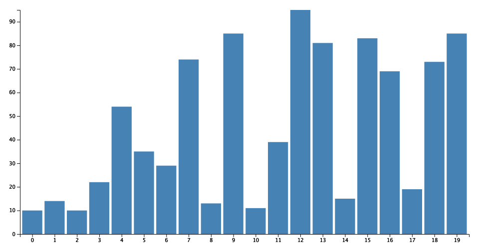

## BarChart

BarChart generator in browser and node.js.

## Install

```bash
npm install
```

## Usage

```js
const markvisBar = require('markvis-bar');
const bar = markvisBar(data, selector, container, style)
```

Check out the [example](./example) for usage.

##### Output the visualization result to a image

```
npm start
```

## Output Preview (png):




## API

### markvisBar(data[, selector, container, style])

#### options

##### data

- Type: `Array`

Data from file or web processed by d3 library.

##### selector

- Type: `String`
- Default: `'#chart'`

DOM selector in container.

##### container

- Type: `String`
- Default: `<div id="container"><h2>Bar Chart</h2><div id="chart"></div></div>`

DOM contain the visualization result.

##### style

- Type: `String`<br>
- Default:
```html
.bar{fill: steelblue;}
.bar:hover{fill: brown;}
.axis{font: 10px sans-serif;}
.axis path,.axis line{fill: none;stroke: #000;shape-rendering: crispEdges;}
.x.axis path{display: none;}
```
Barchart style.

## Contributing

1. Fork it!
2. Create your feature branch: `git checkout -b my-new-feature`
3. Commit your changes: `git commit -am 'Add some feature'`
4. Push to the branch: `git push origin my-new-feature`
5. Submit a pull request :D


### LICENSE

**markvis-bar** © [geekplux](https://github.com/geekplux), Released under the [MIT](./LICENSE) License.<br>
Authored and maintained by geekplux with help from contributors ([list](https://github.com/geekplux/markvis/contributors)).

> [github.com/geekplux](https://github.com/geekplux) · GitHub [@geekplux](https://github.com/geekplux) · Twitter [@geekplux](https://twitter.com/geekplux)
